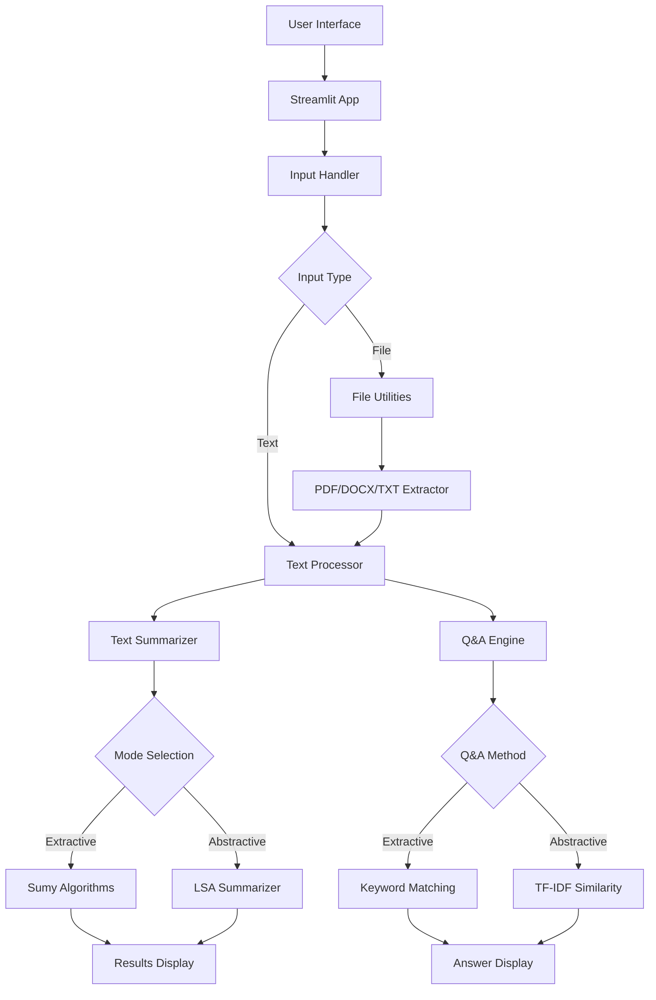
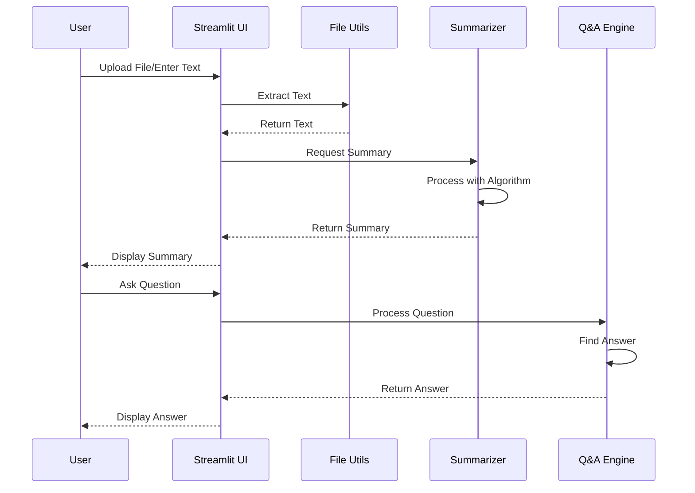
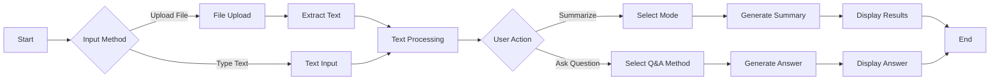

# AI Notes Summarizer

A lightweight web application for automated text summarization and intelligent question-answering. Built with Streamlit and powered by Sumy for fast, local processing without heavy model downloads.

[](https://www.python.org/downloads/)
[](https://streamlit.io/)


## Table of Contents

- [Features](#features)
- [Architecture](#architecture)
- [Installation](#installation)
- [Usage](#usage)
- [Project Structure](#project-structure)
- [Technology Stack](#technology-stack)
- [License](#license)

## Features

### Text Summarization
- **Extractive Methods**: TextRank, LSA, LexRank, Luhn algorithms
- **Abstractive Methods**: Lightweight LSA-based summarization
- **User-Friendly Modes**: Quick Summary, Academic/Research, Professional/Business, Advanced
- **Performance Metrics**: Compression ratio, word count, sentence analysis

### Question & Answer
- **Extractive Q&A**: Instant answers using keyword matching
- **Abstractive Q&A**: Enhanced answers using TF-IDF similarity
- **Hybrid Mode**: Compare both methods side-by-side
- **Confidence Scores**: Relevance indicators for all answers

### Input Methods
- Direct text input (type/paste)
- File upload support (PDF, DOCX, TXT)
- Built-in example text for testing

## Architecture

### System Architecture



### Data Flow



### Component Workflow



## Installation

### Quick Start

```bash
# Clone the repository
git clone https://github.com/amirtha-1412/ai-notes-summarizer.git
cd ai-notes-summarizer

# Install dependencies
pip install -r requirements.txt

# Run the application
streamlit run app.py
```

### Windows Users

```bash
# First-time setup
setup.bat

# Run the application
run.bat
```

### Manual Setup

```bash
# Create virtual environment (optional but recommended)
python -m venv venv
source venv/bin/activate  # On Windows: venv\Scripts\activate

# Install dependencies
pip install -r requirements.txt

# Download NLTK data (automatic on first run)
python -c "import nltk; nltk.download('punkt')"

# Run the application
streamlit run app.py
```

## Usage

### Basic Workflow

1. **Access the Application**
   - Open your browser to `http://localhost:8501`

2. **Input Your Text**
   - Type or paste text directly
   - Upload a PDF, DOCX, or TXT file
   - Use the example text for testing

3. **Generate Summary**
   - Select a summarization mode
   - Click "Generate Summary"
   - View results with statistics

4. **Ask Questions**
   - Scroll to the Q&A section
   - Type your question
   - Select answer method
   - Get instant answers

### Summarization Modes

| Mode | Best For | Algorithm |
|------|----------|-----------|
| Quick Summary | General content | TextRank |
| Academic/Research | Research papers, technical docs | LSA |
| Professional/Business | Reports, emails, articles | LSA (Abstractive) |
| Advanced | Full control over settings | User-selected |

### Q&A Methods

| Method | Speed | Description |
|--------|-------|-------------|
| Extractive Only | <1s | Single most relevant sentence |
| Abstractive | <1s | Multiple sentences combined |
| Both Methods | <2s | Side-by-side comparison |

## Project Structure

```
ai-notes-summarizer/
├── app.py                  # Main Streamlit application
├── summarizer.py           # Core summarization & Q&A engine
├── utils.py                # File handling utilities
├── requirements.txt        # Python dependencies
├── README.md              # Project documentation
├── LICENSE                # MIT License
├── .gitignore             # Git ignore rules
├── .streamlit/
│   └── config.toml        # Streamlit configuration
├── setup.bat              # Windows setup script
└── run.bat                # Windows run script
```

### Core Components

**app.py**
- Streamlit UI setup and layout
- User input handling
- Session state management
- Results display

**summarizer.py**
- TextSummarizer class
- Extractive methods (TextRank, LSA, LexRank, Luhn)
- Abstractive methods (LSA-based)
- Q&A methods (Extractive & TF-IDF)

**utils.py**
- PDF text extraction (PyPDF2)
- DOCX text extraction (python-docx)
- Plain text file reading
- Error handling

## Technology Stack

### Core Technologies
- **Python 3.8+**: Programming language
- **Streamlit 1.30+**: Web framework
- **Sumy**: Summarization algorithms
- **NLTK**: Natural language processing

### File Processing
- **PyPDF2**: PDF text extraction
- **python-docx**: DOCX text extraction

### Algorithms
- **TextRank**: Graph-based extractive summarization
- **LSA**: Latent Semantic Analysis
- **LexRank**: Graph-based ranking
- **Luhn**: Frequency-based summarization
- **TF-IDF**: Term frequency-inverse document frequency

## Performance

- **Extractive Summarization**: 1-2 seconds
- **Abstractive Summarization**: 2-3 seconds
- **Extractive Q&A**: <1 second
- **Abstractive Q&A**: <1 second
- **File Processing**: Depends on file size

## Requirements

- Python 3.8 or higher
- 2GB RAM minimum
- Modern web browser
- Internet connection (for initial NLTK data download)

## Contributing

Contributions are welcome! Please feel free to submit a Pull Request.

1. Fork the repository
2. Create your feature branch (`git checkout -b feature/AmazingFeature`)
3. Commit your changes (`git commit -m 'Add some AmazingFeature'`)
4. Push to the branch (`git push origin feature/AmazingFeature`)
5. Open a Pull Request

## License

This project is licensed under the MIT License - see the [LICENSE](LICENSE) file for details.

## Acknowledgments

- [Streamlit](https://streamlit.io/) - Web framework
- [Sumy](https://github.com/miso-belica/sumy) - Summarization library
- [NLTK](https://www.nltk.org/) - Natural language toolkit
- [PyPDF2](https://pypdf2.readthedocs.io/) - PDF processing
- [python-docx](https://python-docx.readthedocs.io/) - DOCX processing

## Support

For issues, questions, or suggestions:
- Open an issue on GitHub
- Check existing issues for solutions
- Read the documentation

---

**Built for students, researchers, and professionals**
